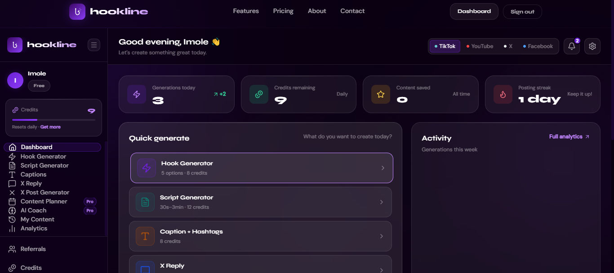
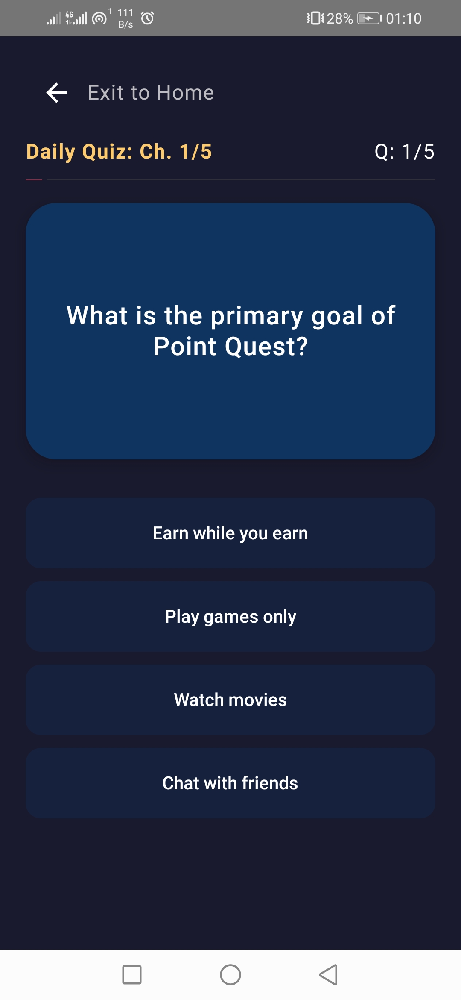
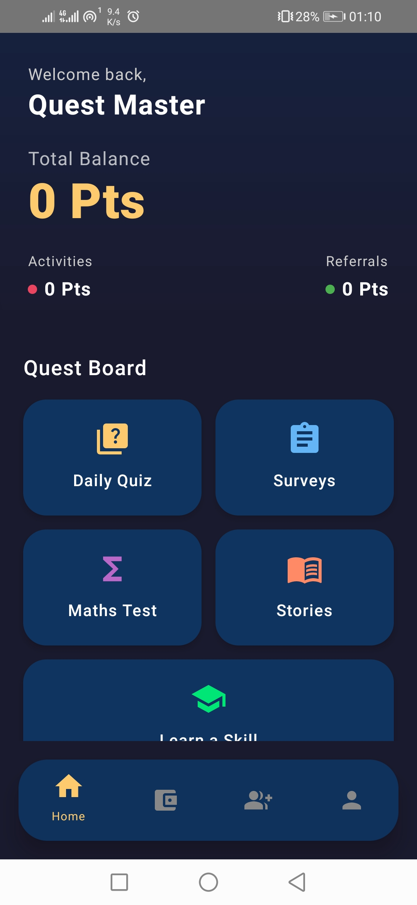
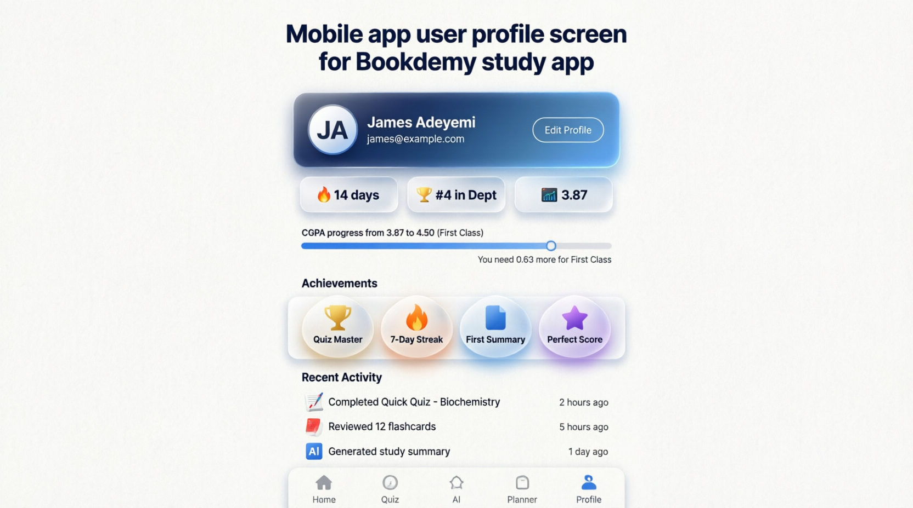
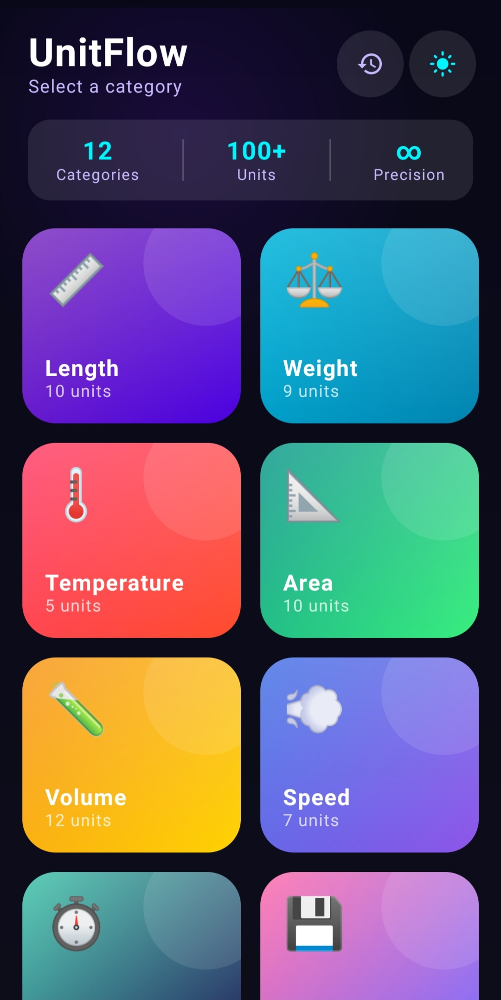

# 👋 Hi, I'm Gideon Sallem
### Senior Mobile Engineer & Full-Stack SaaS Developer

  

  
  
  
  

---

## 🚀 About Me

I am a results-driven **Mobile App Specialist and Full-Stack SaaS Developer** dedicated to engineering high-performance, user-centric digital products. With deep expertise across native Android development (**Kotlin & Jetpack Compose**), cross-platform solutions (**Flutter**), and modern web architectures (**Svelte & Supabase**), I bridge the gap between complex engineering and seamless user experience.

* 💡 **Product-Focused Mindset:** I specialize in taking raw ideas and scaling them into production-ready platforms complete with real-time databases, AI model integrations, and structured monetization loops.
* 🛠️ **Architecture Philosophy:** Strict adherence to Clean Architecture, SOLID principles, MVVM/MVI design patterns, and robust state management to ensure applications are secure, testable, and highly scalable.
* 🔒 **Code Privacy Notice:** *The repositories for my commercial enterprise applications and proprietary SaaS platforms are maintained in private organization environments to safeguard business logic, API keys, and commercial intellectual property. In-depth visual case studies, system breakdowns, and user-flow demonstrations are detailed below.*

---

## 🛠️ Technical Skillset

| Layer | Technologies & Frameworks |
| :--- | :--- |
| **Mobile Development** | Native Android, Kotlin, Jetpack Compose, Flutter, Dart, Android SDK, Material Design 3 |
| **Web & Frontend** | Svelte, SvelteKit, HTML5, CSS3, TypeScript, JavaScript, TailwindCSS |
| **Backend & Database** | Supabase, PostgreSQL, Node.js, Redis (Caching & Rate Limiting), RESTful APIs |
| **AI Integration** | OpenAI API (GPT Models), Anthropic Claude API, Prompt Engineering |
| **DevOps & Analytics** | Git, GitHub Actions (CI/CD), PostHog Analytics, Gradle, VS Code, Android Studio |
| **Monetization & Business** | Paystack, Paddle, Google AdMob Integration, In-App Purchases (IAP) |

---

## 🏆 Featured Projects & Production Portfolios

### 1. Hooklines 🚀 `Active SaaS Development [V1 Production]`
**Type:** AI-Powered Creator Growth Web Application  
**Tech Stack:** Svelte, TypeScript, Supabase (PostgreSQL), OpenAI API, Anthropic Claude API, Redis, PostHog, Paystack, Paddle, Lucide, TailwindCSS  

Hooklines is a premium B2B SaaS architecture engineered to accelerate organic audience growth and streamline high-retention content generation for creators targeting Facebook, TikTok, YouTube, and X (Twitter).

* **Advanced AI Prompt Chaining:** Leverages customized LLM processing via OpenAI and Anthropic pipelines to synthesize viral scripts, pattern-interrupt hooks, conversion-optimized captions, tags, and semantic descriptions.
* **X (Twitter) Growth Engine:** Features an autonomous X Reply Generator and Thread/Post Composer engineered to maximize contextual engagement and algorithmic reach.
* **Interactive AI Strategy Coach:** Embedded conversational mentor trained on multi-platform growth frameworks to provide real-time strategic channel audits.
* **Infrastructure & Security:** Built with Redis-backed token bucket rate-limiting to optimize API overhead and fully integrated with Paystack/Paddle for robust international merchant processing. PostHog analytics map comprehensive behavioral user flows.

  

<em>Figure 1: Hooklines Platform Workspace Dashboard and AI Script Generation Flow.</em>
 

---

### 2. PointQuest 📱 `Production Ready`
**Type:** Gamified Rewarded EdTech Mobile App  
**Tech Stack:** Android SDK, Kotlin, Jetpack Compose, Supabase (Real-Time Database, Auth, Storage), Coroutines, Flow, MVVM  

PointQuest transforms high-demand digital skill acquisition into an immersive, reward-driven experience. Users master technical disciplines while interacting with interactive quiz systems and analytic surveys to yield redeemable incentives.

* **Dynamic Learning Engine:** Architecture facilitates modular micro-learning courses across high-demand skills, triggering responsive evaluation parameters (quizzes, logical math matrices, questionnaires).
* **Reactive Reward System:** Utilizes Supabase Real-time database listeners and Kotlin Flow to instantly update user point balances upon verified module completion, preventing localized database tampering.
* **State-of-the-Art UI/UX:** Built entirely on Jetpack Compose using fluid declarative states and strict Material 3 structural parameters.

   &nbsp;&nbsp;&nbsp;&nbsp;
  

<em>Figure 2: User interface execution, real-time leaderboards, and gamified quiz systems.</em>

---

### 3. WordPuzzleHero 🎮 `Production Ready`
**Type:** Gamified Word-Matrix Android Application  
**Tech Stack:** Android SDK, Kotlin, Jetpack Compose, Supabase Backend, Google AdMob SDK, State-Driven Game Loops  

A highly interactive word puzzle game engineered to test lexical knowledge, spatial layout planning, and cognitive reasoning. Designed from the ground up for high user retention and sustainable monetization loops.

* **Algorithmic Matrix Validation:** Custom logical verification engine built in Kotlin to parse scattered letter arrays and calculate coordinate placement in real-time.
* **Secure Ledger Synchronization:** Points earned inside the native game loops are validated through backend checks and stored within a secured Supabase PostgreSQL ledger.
* **Monetization Architecture:** Native integration of Google AdMob, running structured rewarded interstitial ad video setups to optimize eCPM while preserving app performance.

   &nbsp;&nbsp;&nbsp;&nbsp;
  

<em>Figure 3: Core gameplay interactions, dictionary lookup matrices, and user point ledgers.</em>

---

### 4. Bookdemy 📚 `Enterprise Conceptual MVP [Paused]`
**Type:** AI-Powered Academic Optimization Platform  
**Tech Stack:** Flutter, Dart, Supabase Backend, Integrated LLM APIs, BLoC Pattern State Management  

An educational infrastructure engineered for university students to optimize study pipelines, streamline content ingestion, and maximize grade point averages through contextual machine intelligence.

* **AI Study Synthesis:** Architectural plans include vector embeddings to allow direct parsing of heavy academic textbooks, automatically rendering flashcards, active recall mock exams, and structured summaries.
* **Cross-Platform Performance:** Built using Flutter and structured around the BLoC pattern to guarantee deterministic state flow across both Android and iOS targets.
* **Project Lifecycle Status:** *Currently paused at the core structural MVP stage. Architecture scales fluidly across multi-platform viewports, waiting for Phase 2 vector store integration.*

  

<em>Figure 4: Interface mockups displaying AI-driven flashcard modules and document processing portals.</em>

---

### 5. FocusPad 📱 `Production Utility`
**Type:** Offline-First Personal Productivity Suite  
**Tech Stack:** Android SDK, Kotlin, Jetpack Compose, Room Database, SQLite, Coroutines, Local Android Notification Manager  

An offline-first, privacy-respecting productivity application designed to streamline daily scheduling, task tracking, and information management without relying on external network dependencies.

* **5-in-1 Native Modules:** Features a rich rich-text Notebook, a comprehensive Task To-Do Manager, an Event Scheduler, a local Document Organizer, and a Calendar Canvas.
* **Robust Offline Persistence:** Uses Android Room abstraction over a local SQLite cluster, deploying explicit background workers and Coroutines to handle heavy structural reads/writes with zero main-thread lag.
* **Local Notification Pushes:** Leverages the native Android Notification Manager to execute precise event reminders based on localized epoch timestamp alerts.

  

<em>Figure 5: In-app execution demonstrating real-time local persistence and calendar views.</em>

---

### 6. UnitConverterApp 🧮 `Utility`
**Type:** High-Speed Offline Conversion Engine  
**Tech Stack:** Flutter, Dart, Client-Side Unit Conversion Matrices, Provider State Management  

A fast, lightweight, ultra-responsive cross-platform application developed to perform localized physical quantity conversions across various scientific families instantly and accurately.

* **Deterministic Arithmetic Engine:** Tailored conversion algorithms provide zero-latency transformations (e.g., volumetric, weight, metric, thermal metrics) without network connectivity.
* **Clean UI System:** Designed with minimalist interface principles to emphasize instantaneous input resolution and data clarity.

   

<em>Figure 6: Demonstration of real-time multi-family volumetric and dimensional conversions.</em>

---

### 7. CalculatorApp 🔢 `Utility`
**Type:** Clean Fluid-UI Utility App  
**Tech Stack:** Flutter, Dart, Mathematical Expression Parser Engine  

A highly accurate, responsive, and beautifully animations-driven digital calculator built to execute core mathematical equations flawlessly.

* **Asynchronous Expression Parsing:** Leverages a reliable tokenizing parser to securely evaluate compound mathematical string statements seamlessly.
* **Fluid Responsive Web/Mobile Views:** Styled to conform beautifully to varying viewport scales, emphasizing smooth interactive micro-gestures.

  

<em>Figure 7: Live layout analysis showing mathematical expression evaluation.</em>

---

⚡ **Developer Philosophy:** *"Writing code is just one step of the job. True engineering lies in structuring stable architectures, creating intuitive user interfaces, and shipping functional solutions that directly impact the bottom line."*

⭐ **Let's Build Together:** If you are a prospective client looking to launch an app, or an employer looking for a dedicated full-stack mobile specialist who knows how to ship products from start to finish, let's hop on a call. Reach out to me via **[Gmail](mailto:gideonsallem@gmail.com)** or explore my active web frameworks right here on GitHub!
